<div align="center">

<!-- Hero Banner Vector SVG -->


<br />

<!-- Animated Typing SVG -->
<a href="https://github.com/asishkashyap">
  
</a>

<br />

### 🚀 *"Architecting Zero-Trust Cloud Platforms & Autonomous AI SRE Workflows"*

<!-- Status Badges Row -->
[](https://github.com/asishkashyap)
[](https://github.com/asishkashyap)
[](mailto:kashyapashish29@gmail.com)

<br />

<!-- CTA Badges Matrix -->
[](https://asishkashyap.github.io/asishkashyap/)
[](https://asishkashyap.com)
[](https://linkedin.com/in/asishkashyap)
[](https://x.com/asishkashyap1)
[](mailto:kashyapashish29@gmail.com)

<br />

<!-- SaaS Hero Metric Cards Grid -->
<table>
  <tr>
    <td align="center" width="25%">
      <h2>⚡ 6+ Yrs</h2>
      <sub>DevSecOps &amp; Cloud</sub>
    </td>
    <td align="center" width="25%">
      <h2>🛡️ Zero-Trust</h2>
      <sub>K8s &amp; Azure OIDC</sub>
    </td>
    <td align="center" width="25%">
      <h2>📦 100+</h2>
      <sub>Terraform Modules</sub>
    </td>
    <td align="center" width="25%">
      <h2>🤖 AI SRE</h2>
      <sub>Autonomous Workflows</sub>
    </td>
  </tr>
</table>

</div>

---

## 🎯 Recruiter & Leadership Executive Summary

```bash
$ asish --version
Asish Kashyap v3.6.0 (Systems & AI Architecture Edition)

$ asish --get-summary
> Senior DevSecOps & AI Engineer (6+ yrs) | Building Zero-Trust CI/CD pipelines, Kubernetes IDPs & Autonomous AI SRE agents.
> Location: Greater Noida, India | Remote
> Target Scope: Senior DevSecOps Engineer, Platform Architect, Lead Infrastructure & AI SRE.

$ asish --list-passions
[✓] High-throughput Distributed Systems & Cloud Native Platform Engineering
[✓] Zero-Trust Kubernetes Control Planes (EKS / AKS) & Service Meshes (Istio/Cilium)
[✓] DevSecOps, Shift-Left Security & Terraform Infrastructure as Code
[✓] Autonomous AI Agent Workflows, LLM RAG Engines & Self-Healing SRE Automation
```

---

## 🏆 Key Quantitative Engineering Achievements

<table>
  <tr>
    <th width="30%">Impact Domain</th>
    <th width="70%">Engineering Milestone &amp; Production Outcome</th>
  </tr>
  <tr>
    <td><b>📈 99.99% Availability</b></td>
    <td>Architected resilient multi-region Kubernetes control planes with blue/green traffic shifting and automated failover recovery.</td>
  </tr>
  <tr>
    <td><b>🔐 Zero-Trust Security</b></td>
    <td>Eliminated hardcoded cloud credentials across 50+ repositories using Azure OIDC passwordless federated authentication and automated Checkov IaC scans.</td>
  </tr>
  <tr>
    <td><b>🚀 70% Faster Releases</b></td>
    <td>Designed enterprise modular GitHub Actions reusable workflows, reducing CI/CD pipeline execution duration from 25m to 7m.</td>
  </tr>
  <tr>
    <td><b>🤖 AI SRE Agents</b></td>
    <td>Developed autonomous AI incident triage bots utilizing Gemini API for real-time anomaly log parsing and pod diagnostic summaries.</td>
  </tr>
</table>

---

## 🛠️ Technology Stack & Ecosystem

### 🔸 Cloud Native & DevOps
<div align="center">

     

</div>

### 🔸 AI Systems & Backend
<div align="center">

     

</div>

### 🔸 Security, Databases & Tooling
<div align="center">

     

</div>

---

## 🚀 Featured Open Source Repositories & Monorepos

<table>
  <tr>
    <td width="100%">
      <h3 align="left">🔹 <a href="https://github.com/asishkashyap/asishkashyap"><b>asishkashyap</b></a> <code>⭐ Profile Hub</code></h3>
      <p><i>Personal GitHub Profile Studio &amp; Portfolio ecosystem featuring dynamic Markdown generation, SVG assets, and interactive terminal intros.</i></p>
      <p>
        <b>Primary Stack:</b> <code>TypeScript</code> &nbsp;|&nbsp;
        ⭐ <b>Stars:</b> <code>12</code> &nbsp;|&nbsp;
        🍴 <b>Forks:</b> <code>5</code>
      </p>
      <p><b>Topics:</b> <code>#github-profile</code> <code>#typescript</code> <code>#react</code> <code>#tailwind</code> <code>#devops</code> <code>#branding</code> <code>#portfolio</code></p>
    </td>
  </tr>
</table>

<table>
  <tr>
    <td width="100%">
      <h3 align="left">🔹 <a href="https://github.com/asishkashyap/dockerVolumeDocApp"><b>dockerVolumeDocApp</b></a> <code>🐳 Docker &amp; Storage</code></h3>
      <p><i>Containerized documentation platform demonstrating Docker persistent volume drivers, container mounts, and zero-root Nginx server.</i></p>
      <p>
        <b>Primary Stack:</b> <code>Docker</code> &nbsp;|&nbsp;
        ⭐ <b>Stars:</b> <code>3</code> &nbsp;|&nbsp;
        🍴 <b>Forks:</b> <code>4</code>
      </p>
      <p><b>Topics:</b> <code>#docker</code> <code>#volumes</code> <code>#containers</code> <code>#devops</code> <code>#nginx</code> <code>#container-security</code> <code>#docker-compose</code></p>
    </td>
  </tr>
</table>

<table>
  <tr>
    <td width="100%">
      <h3 align="left">🔹 <a href="https://github.com/asishkashyap/github-actions-devsecops-suite"><b>github-actions-devsecops-suite</b></a> <code>⚡ CI/CD Automation</code></h3>
      <p><i>Enterprise GitHub Actions CI/CD framework featuring reusable workflows, matrix pipelines, DevSecOps scanners, and OIDC auth.</i></p>
      <p>
        <b>Primary Stack:</b> <code>YAML</code> &nbsp;|&nbsp;
        ⭐ <b>Stars:</b> <code>8</code> &nbsp;|&nbsp;
        🍴 <b>Forks:</b> <code>4</code>
      </p>
      <p><b>Topics:</b> <code>#github-actions</code> <code>#cicd</code> <code>#devsecops</code> <code>#automation</code> <code>#reusable-workflows</code> <code>#oidc</code> <code>#security</code></p>
    </td>
  </tr>
</table>

<table>
  <tr>
    <td width="100%">
      <h3 align="left">🔹 <a href="https://github.com/asishkashyap/terraform-azure-enterprise"><b>terraform-azure-enterprise</b></a> <code>☁️ Cloud IaC Monorepo</code></h3>
      <p><i>Consolidated Azure IaC monorepo provisioning AKS clusters, VNet networking, Key Vaults, and private endpoints with Checkov security.</i></p>
      <p>
        <b>Primary Stack:</b> <code>HCL</code> &nbsp;|&nbsp;
        ⭐ <b>Stars:</b> <code>9</code> &nbsp;|&nbsp;
        🍴 <b>Forks:</b> <code>5</code>
      </p>
      <p><b>Topics:</b> <code>#terraform</code> <code>#azure</code> <code>#iac</code> <code>#aks</code> <code>#devsecops</code> <code>#checkov</code> <code>#tflint</code> <code>#cloud-architecture</code></p>
    </td>
  </tr>
</table>

<table>
  <tr>
    <td width="100%">
      <h3 align="left">🔹 <a href="https://github.com/asishkashyap/InfraPipeline"><b>InfraPipeline</b></a> <code>🔐 DevSecOps Pipeline</code></h3>
      <p><i>End-to-end DevSecOps infrastructure delivery pipeline with passwordless Azure OIDC auth, Terraform automation, and policy gates.</i></p>
      <p>
        <b>Primary Stack:</b> <code>HCL</code> &nbsp;|&nbsp;
        ⭐ <b>Stars:</b> <code>5</code> &nbsp;|&nbsp;
        🍴 <b>Forks:</b> <code>3</code>
      </p>
      <p><b>Topics:</b> <code>#devsecops</code> <code>#infrapipeline</code> <code>#terraform</code> <code>#azure</code> <code>#oidc</code> <code>#checkov</code> <code>#security-pipeline</code></p>
    </td>
  </tr>
</table>

<table>
  <tr>
    <td width="100%">
      <h3 align="left">🔹 <a href="https://github.com/asishkashyap/kubernetes-secure-approach"><b>kubernetes-secure-approach</b></a> <code>☸️ K8s Security</code></h3>
      <p><i>Hardened Kubernetes zero-trust security configuration featuring Pod Security Standards, Kyverno policies, and Vault integration.</i></p>
      <p>
        <b>Primary Stack:</b> <code>YAML</code> &nbsp;|&nbsp;
        ⭐ <b>Stars:</b> <code>7</code> &nbsp;|&nbsp;
        🍴 <b>Forks:</b> <code>2</code>
      </p>
      <p><b>Topics:</b> <code>#kubernetes</code> <code>#security</code> <code>#zero-trust</code> <code>#kyverno</code> <code>#vault</code> <code>#pod-security-standards</code> <code>#network-policy</code></p>
    </td>
  </tr>
</table>

---

## 📜 Professional Certifications & Verified Credentials

<div align="center">

[](https://kubernetes.io/)
[](https://kubernetes.io/)
[](https://azure.microsoft.com/)
[](https://www.terraform.io/)
[](https://aws.amazon.com/)

</div>

---

## 🔍 Collapsible Technical Deep Dives & Architecture Specs

<details>
<summary>🏛️ <b>Deep-Dive Systems Architecture & Design Philosophy</b> (Click to expand)</summary>

<br />

<div align="center">
  
  <br /><br />
  
</div>

<br />

### 1. Immutable Infrastructure & GitOps
All infrastructure state is codified in Terraform monorepos (`terraform-azure-enterprise`). State modifications require peer-reviewed Pull Requests validated by `tflint`, `checkov`, and dry-run `terraform plan` executions via Azure OIDC.

### 2. Zero-Trust Kubernetes Pod Security
Workloads run under the `Restricted` Pod Security Standard. Root processes are forbidden (`runAsNonRoot: true`), root filesystems are mounted read-only, Linux capabilities are stripped, and inter-pod network isolation is enforced by default-deny NetworkPolicies.

### 3. Autonomous AI SRE Workflows
Operational logs and metric streams are analyzed by event-driven serverless workers. Anomaly clusters are passed to Gemini LLM agents to generate root-cause hypotheses and recommend remediation steps to on-call engineers.

</details>

<details>
<summary>🗺️ <b>Strategic Learning & Engineering Roadmap (Q3 / Q4 2026)</b> (Click to expand)</summary>

<br />

- [ ] **eBPF Kernel Observability:** Implementing Cilium Service Mesh & Hubble deep packet kernel monitoring.
- [ ] **Multi-Agent Orchestration:** Scaling distributed LLM agent swarms with LangGraph and server-side Gemini function calling.
- [ ] **WebAssembly at the Edge:** Exploring Spin/Wasmtime micro-runtimes for low-latency edge computing.

</details>

---

## 📊 Live GitHub Developer Metrics & Activity Dashboard

<div align="center">


<br/>


</div>

### 🐍 Contribution Graph Eat-the-Grid Snake

<div align="center">
  <picture>
    <source media="(prefers-color-scheme: dark)" srcset="https://raw.githubusercontent.com/asishkashyap/asishkashyap/output/github-contribution-grid-snake-dark.svg" />
    <source media="(prefers-color-scheme: light)" srcset="https://raw.githubusercontent.com/asishkashyap/asishkashyap/output/github-contribution-grid-snake.svg" />
    
  </picture>
</div>

---

## 🌐 Connect & Technical Collaboration

<div align="center">

<table>
  <tr>
    <td align="center"><b>📬 Direct Email</b></td>
    <td align="center"><a href="mailto:kashyapashish29@gmail.com"><code>kashyapashish29@gmail.com</code></a></td>
  </tr>
  <tr>
    <td align="center"><b>💼 LinkedIn Profile</b></td>
    <td align="center"><a href="https://linkedin.com/in/asishkashyap"><code>linkedin.com/in/asishkashyap</code></a></td>
  </tr>
  <tr>
    <td align="center"><b>🐦 X (Twitter)</b></td>
    <td align="center"><a href="https://x.com/asishkashyap1"><code>@asishkashyap1</code></a></td>
  </tr>
  <tr>
    <td align="center"><b>🌐 Personal Site</b></td>
    <td align="center"><a href="https://asishkashyap.com"><code>https://asishkashyap.com</code></a></td>
  </tr>
</table>

<br />

<sub>Designed with ❤️, Precision &amp; Markdown Craftsmanship by <b><a href="https://github.com/asishkashyap">Asish Kashyap</a></b></sub>

</div>
