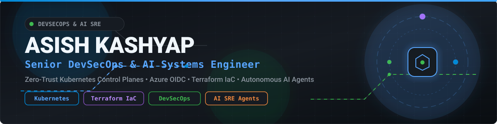

  

   

  <h1>👋 Hi, I'm Ashish Kashyap</h1>
  
<strong>Senior DevOps & Platform Engineer</strong>

  

    
    
    
  

## 💻 Tech Stack & Shields

  
  
  
  
  
   
  
  
  
  
  

---

## ⚡ Currently Working As

- 🚀 **Internal Developer Platforms (IDP)**
- 🤖 **AI-powered DevOps & Auto SRE**
- ☸️ **Kubernetes Platform Engineering**
- ⚡ **GitHub Actions Automation**
- 🔐 **DevSecOps & Shift-Left Security**
- ☁️ **Azure Cloud Infrastructure**

---

## 🚀 What I'm Working On

- 🌱 Learning **Generative AI**, **LLM Integrations**, **Platform Engineering**
- 🔭 Building **AI-driven Kubernetes Auto SRE**
- ⚙️ Automating deployments using **GitHub Actions**
- 📦 Creating reusable CI/CD pipeline templates
- 📚 Teaching Azure DevOps, GitHub Actions, and Terraform

---

## 🐍 GitHub Contribution Snake

  <picture>
    <source media="(prefers-color-scheme: dark)" srcset="https://raw.githubusercontent.com/asishkashyap/asishkashyap/output/github-contribution-grid-snake-dark.svg" />
    <source media="(prefers-color-scheme: light)" srcset="https://raw.githubusercontent.com/asishkashyap/asishkashyap/output/github-contribution-grid-snake.svg" />
    
  </picture>

---

## 📂 Repository Architecture

- 🤖 **`.github/workflows/`**: Continuous integration workflows for automated contribution snake generation and metrics sync.
- 🎨 **`assets/`**: Vector graphics, banners, waves, and platform badges.
- 📖 **`docs/`**: Branding guide, setup customization walkthrough, and engineering roadmap.
- ⚡ **`scripts/`**: Automation scripts for SVG generation and README dynamic feeds.

---

  Built with ❤️ and engineered with precision. © 2026 Ashish Kashyap.

