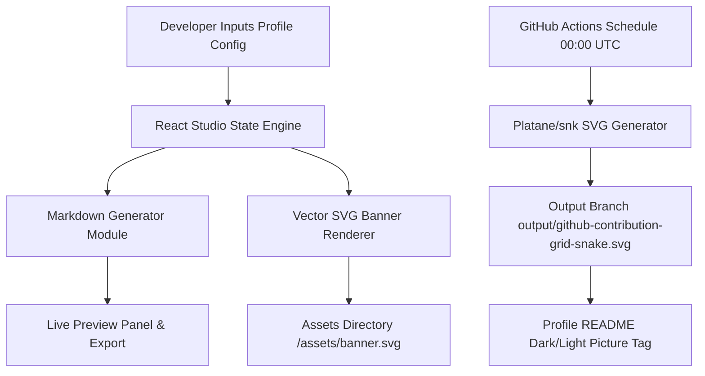

# 📂 Repository Showcase: `asishkashyap` (Profile Studio & Brand Portfolio Hub)

[](https://github.com/asishkashyap/asishkashyap)
[](LICENSE)
[](.github/workflows/snake.yml)
[](https://www.typescriptlang.org/)

---

## 📖 Description & Purpose
The central GitHub Profile Studio application and personal portfolio ecosystem for **Asish Kashyap** (Senior DevSecOps & AI Engineer). Designed to dynamically compile and render developer metrics, dark-mode vector hero banners, custom SVG asset streams, interactive terminal intros, and eat-the-grid contribution snake animations.

---

## 🏷️ Recommended Metadata & Topics
* **Description:** Personal GitHub Profile Studio & Portfolio application with interactive architecture preview and live Markdown generation.
* **Topics:** `github-profile`, `typescript`, `react`, `tailwind`, `devops`, `branding`, `developer-portfolio`, `svg-studio`

---

## 📐 Architecture & Execution Flow



---

## 📁 Repository Directory Structure

```
.
├── .github/
│   └── workflows/
│       ├── snake.yml          # Automated daily snake contribution SVG generator
│       ├── validate.yml       # SVG linting & Markdown validation workflow
│       └── metrics.yml        # Weekly developer metrics generation
├── assets/
│   ├── banner.svg             # Dark Slate 1200x300 hero vector banner
│   ├── hero.svg               # Systems architecture visual banner
│   ├── kubernetes.svg         # K8s control plane vector asset
│   └── platform.svg           # Cloud platform ecosystem vector asset
├── docs/
│   ├── GITHUB_TRANSFORMATION_MASTER_PLAN.md
│   ├── GITHUB_ISSUES_BACKLOG.md
│   ├── branding-guide.md
│   └── customization.md
├── src/
│   ├── components/            # Live Readme Preview, Folder Tree, Design System
│   ├── data/                  # Profile Data, Tech Stack Badges, Markdown Templates
│   ├── App.tsx                # Studio main UI
│   └── types.ts               # Shared TypeScript interfaces
├── scripts/
│   ├── create-github-issues.js
│   ├── generate-svgs.js
│   └── update-readme.js
├── index.html
├── metadata.json
├── package.json
└── README.md
```

---

## ⚡ Quickstart & Developer Experience

```bash
# Clone the repository
git clone https://github.com/asishkashyap/asishkashyap.git
cd asishkashyap

# Install dependencies
npm install

# Launch local development server
npm run dev

# Run TypeScript linter
npm run lint

# Build production bundle
npm run build
```

---

## 🎯 Recruiter & Hiring Manager Value
* **Demonstrates:** Advanced React/TypeScript software craft, SVG manipulation, automated GitHub Actions CI/CD workflows, and meticulous developer documentation standards.
