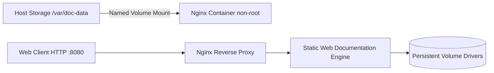

# 📂 Repository Showcase: `dockerVolumeDocApp` (Containerized Storage & Documentation Platform)

[](https://www.docker.com/)
[](LICENSE)
[](.github/workflows/container-security.yml)
[](#security-hardening)

---

## 📖 Description & Purpose
A containerized web application platform demonstrating Docker persistent volume drivers, container mounts (`bind mounts` and `named volumes`), multi-stage Dockerfile builds, and zero-downtime static documentation delivery behind an optimized Nginx web server.

---

## 🏷️ Recommended Metadata & Topics
* **Description:** Containerized documentation platform demonstrating Docker persistent volume drivers, container mounts, and Nginx web server integration.
* **Topics:** `docker`, `volumes`, `containers`, `devops`, `nginx`, `container-security`, `docker-compose`, `multi-stage-build`

---

## 📐 Architecture & Execution Flow



---

## 📁 Repository Directory Structure

```
.
├── .github/
│   └── workflows/
│       └── container-security.yml  # Automated Trivy vulnerability container scanner
├── docker/
│   ├── Dockerfile                  # Hardened multi-stage non-root container image
│   ├── nginx.conf                  # Production Nginx security headers & caching config
│   └── docker-compose.yml          # Multi-container orchestration with persistent volumes
├── docs/
│   ├── index.html                  # Documentation entrypoint
│   └── styles.css                  # Modern responsive stylesheet
├── scripts/
│   └── volume-backup.sh            # Automated volume backup & snapshot utility
├── LICENSE                         # MIT License
└── README.md                       # Enterprise repository README
```

---

## 🔒 Security Hardening Highlights
1. **Multi-Stage Build:** Reduces container attack surface by stripping build-time dependencies.
2. **Non-Root Execution:** Runs Nginx process under unprivileged user ID `10001` (`appuser`).
3. **Read-Only Root Filesystem:** Container root filesystem is mounted read-only with ephemeral `/tmp` and `/var/run` tmpfs mounts.
4. **Automated Vulnerability Scan:** Aqua Security Trivy workflow blocks `CRITICAL` CVE container vulnerabilities on Pull Requests.

---

## ⚡ Quickstart & Local Execution

```bash
# Clone repository
git clone https://github.com/asishkashyap/dockerVolumeDocApp.git
cd dockerVolumeDocApp

# Launch container stack with persistent named volume
docker compose up -d

# Inspect active volume mounts
docker volume inspect docapp_data_volume

# Access local web app
curl http://localhost:8080
```

---

## 🎯 Recruiter & Hiring Manager Value
* **Demonstrates:** Production Docker mastery, container security best practices, persistent storage drivers, and zero-root container isolation.
