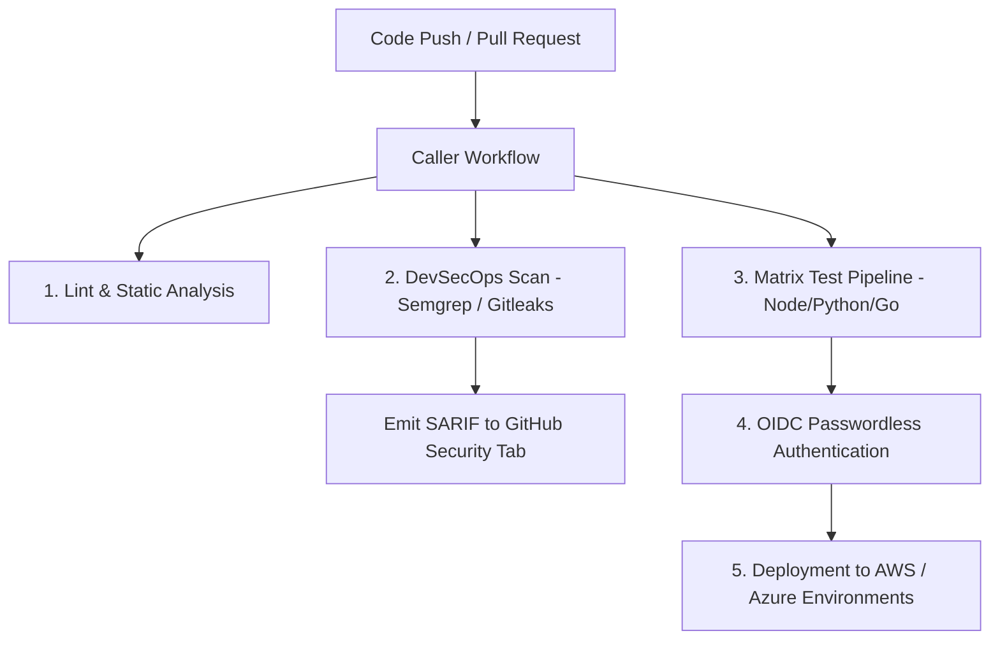

# 📂 Repository Showcase: `github-actions-devsecops-suite` (Enterprise CI/CD Automation)

[](https://github.com/features/actions)
[](LICENSE)
[](#reusable-workflow-architecture)
[](#security--governance)

---

## 📖 Description & Purpose
An enterprise-grade repository containing reusable GitHub Actions workflows, composite actions, matrix build strategies, security scanners (SAST, Dependency Review, Container Scanning, Secret Detection), and OIDC cloud provider authentication patterns.

---

## 🏷️ Recommended Metadata & Topics
* **Description:** Enterprise GitHub Actions CI/CD framework featuring reusable workflows, matrix strategy pipelines, DevSecOps security scanners, and OIDC auth.
* **Topics:** `github-actions`, `cicd`, `devsecops`, `automation`, `reusable-workflows`, `oidc`, `security`, `matrix-builds`

---

## 📐 Architecture & Execution Flow



---

## 📁 Repository Directory Structure

```
.
├── .github/
│   ├── actions/
│   │   ├── setup-toolchain/         # Composite action for caching and environment setup
│   │   └── security-audit/          # Composite action for SAST and secret scanning
│   └── workflows/
│       ├── reusable-build.yml       # Centralized build engine callable via workflow_call
│       ├── reusable-security.yml    # Centralized DevSecOps scanning
│       ├── reusable-terraform.yml   # IaC validation and Checkov security scan
│       └── main-ci.yml              # Entrypoint workflow invoking reusable actions
├── templates/
│   ├── nodejs-ci-template.yml
│   └── python-ci-template.yml
├── docs/
│   └── REUSABLE_WORKFLOWS_GUIDE.md
├── LICENSE
└── README.md
```

---

## 🛠️ Reusable Workflow Usage Example

```yaml
# In any target repository: .github/workflows/deploy.yml
name: App Pipeline

on:
  push:
    branches: [ main ]

jobs:
  security-audit:
    uses: asishkashyap/github-actions-devsecops-suite/.github/workflows/reusable-security.yml@v1
    with:
      enable-gitleaks: true
      enable-semgrep: true

  build-and-test:
    needs: security-audit
    uses: asishkashyap/github-actions-devsecops-suite/.github/workflows/reusable-build.yml@v1
    with:
      node-version: '20'
      run-tests: true
```

---

## 🎯 Recruiter & Hiring Manager Value
* **Demonstrates:** Enterprise CI/CD pipeline architecture, modular workflow composition, passwordless OIDC security, and matrix build optimization.
