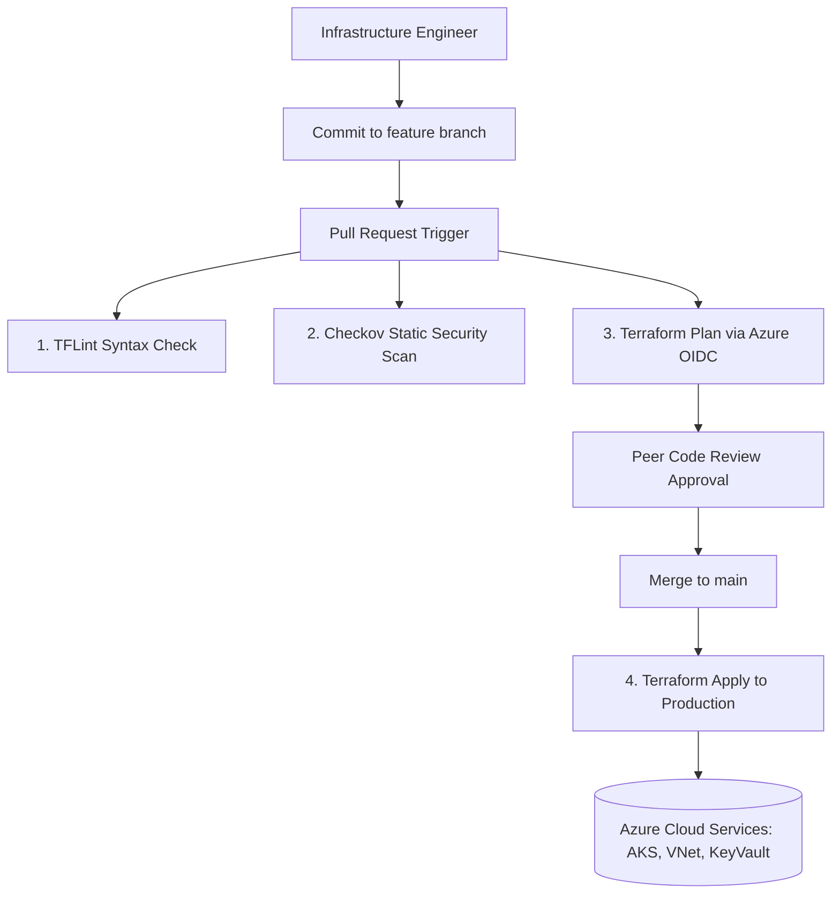

# 📂 Repository Showcase: `terraform-azure-enterprise` (Modular Cloud IaC Monorepo)

[](https://www.terraform.io/)
[](https://azure.microsoft.com/)
[](#iac-security-policy)
[](LICENSE)

---

## 📖 Description & Purpose
A consolidated enterprise Terraform infrastructure-as-code (IaC) monorepo provisioning resilient Azure cloud environments (AKS Kubernetes clusters, Virtual Networks, Key Vaults, Private Endpoints, Storage Accounts) structured with modular reusable architecture, remote state locking, and automated Checkov security compliance controls.

---

## 🏷️ Recommended Metadata & Topics
* **Description:** Enterprise Azure Terraform IaC monorepo provisioning AKS clusters, VNet networking, Key Vaults, and private endpoints with automated Checkov security.
* **Topics:** `terraform`, `azure`, `infrastructure-as-code`, `aks`, `devsecops`, `checkov`, `tflint`, `cloud-architecture`

---

## 📐 Architecture & Execution Flow



---

## 📁 Repository Directory Structure

```
.
├── modules/
│   ├── networking/
│   │   ├── main.tf             # VNet, Subnets, Network Security Groups
│   │   ├── variables.tf
│   │   └── outputs.tf
│   ├── aks-cluster/
│   │   ├── main.tf             # Azure Kubernetes Service with Managed Identity
│   │   └── variables.tf
│   ├── key-vault/
│   │   ├── main.tf             # Azure Key Vault with RBAC & Soft Delete
│   │   └── variables.tf
│   └── storage/
│       └── main.tf             # Storage account with private endpoint & TLS 1.3
├── environments/
│   ├── dev/
│   │   ├── main.tf             # Dev environment configuration
│   │   └── terraform.tfvars
│   └── prod/
│       ├── main.tf             # Production environment configuration
│       └── terraform.tfvars
├── .github/
│   └── workflows/
│       └── terraform-ci.yml    # Linting, Checkov scan, and OIDC Plan workflow
├── LICENSE
└── README.md
```

---

## ⚡ Quickstart Execution

```bash
# Clone repository
git clone https://github.com/asishkashyap/terraform-azure-enterprise.git
cd terraform-azure-enterprise/environments/dev

# Initialize Terraform modules and backend state
terraform init

# Run TFLint and Checkov locally
tflint
checkov -d .

# Dry-run infrastructure execution plan
terraform plan
```

---

## 🎯 Recruiter & Hiring Manager Value
* **Demonstrates:** Enterprise IaC software engineering, modular Terraform architecture, Azure cloud networking & AKS provisioning, zero-trust secrets storage, and automated static security checks.
