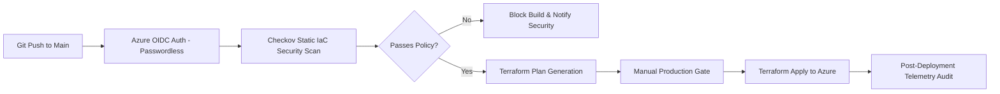

# 📂 Repository Showcase: `InfraPipeline` (DevSecOps Infrastructure Delivery Pipeline)

[](https://azure.microsoft.com/en-us/products/devops)
[](.github/workflows/pipeline.yml)
[](#pipeline-security)
[](LICENSE)

---

## 📖 Description & Purpose
An end-to-end DevSecOps infrastructure delivery pipeline orchestrating multi-cloud resource deployment via Terraform, secretless Azure OIDC federated authentication, shift-left Checkov IaC security policy enforcement, and automated rollback capabilities.

---

## 🏷️ Recommended Metadata & Topics
* **Description:** End-to-end DevSecOps infrastructure delivery pipeline featuring Azure OIDC authentication, Terraform automation, and Checkov security gate enforce.
* **Topics:** `devsecops`, `infrapipeline`, `terraform`, `azure`, `oidc`, `checkov`, `security-pipeline`, `ci-cd`

---

## 📐 Architecture & Pipeline Flow



---

## 📁 Repository Directory Structure

```
.
├── .github/
│   └── workflows/
│       └── pipeline.yml         # GitHub Actions pipeline with Azure OIDC & Checkov
├── azure-pipelines.yml          # Mirror Azure DevOps YAML pipeline
├── terraform/
│   ├── main.tf                  # Infrastructure state and provider configuration
│   ├── modules/                 # Reusable compute and database modules
│   └── policies/                # Custom Checkov YAML policies
├── scripts/
│   ├── validate-oidc.sh         # OIDC token verification tool
│   └── post-deploy-check.sh     # Health check and telemetry verify script
├── LICENSE
└── README.md
```

---

## ⚡ Local Verification Commands

```bash
# Clone repository
git clone https://github.com/asishkashyap/InfraPipeline.git
cd InfraPipeline

# Validate Terraform syntax
terraform -chdir=terraform fmt -check

# Execute Checkov security scan against custom policies
checkov -d terraform/ --framework terraform
```

---

## 🎯 Recruiter & Hiring Manager Value
* **Demonstrates:** Shift-left security pipeline enforcement, passwordless OIDC cloud integration, automated policy gates, and enterprise deployment safety controls.
