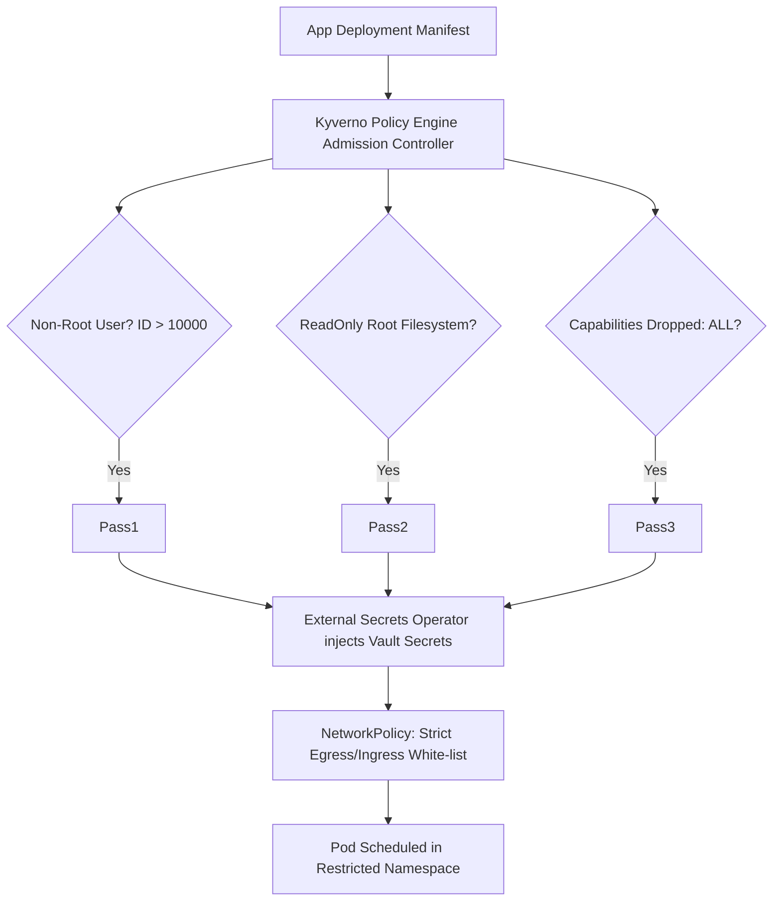

# 📂 Repository Showcase: `kubernetes-secure-approach` (Zero-Trust K8s Hardening & Pod Security)

[](https://kubernetes.io/)
[](#pod-security-standards)
[](https://www.vaultproject.io/)
[](LICENSE)

---

## 📖 Description & Purpose
A comprehensive zero-trust Kubernetes cluster hardening suite implementing Pod Security Standards (`Restricted` enforcement), Kyverno policy engine rules, HashiCorp Vault / External Secrets Operator integration, RBAC principle of least privilege, and container network isolation policies.

---

## 🏷️ Recommended Metadata & Topics
* **Description:** Hardened Kubernetes zero-trust security configuration featuring Pod Security Standards, Kyverno policies, Vault secrets, and NetworkPolicies.
* **Topics:** `kubernetes`, `security`, `zero-trust`, `kyverno`, `vault`, `pod-security-standards`, `network-policy`, `k8s-hardening`

---

## 📐 Architecture & Security Control Flow



---

## 📁 Repository Directory Structure

```
.
├── manifests/
│   ├── pod-security-standards/ # Namespace labels for baseline & restricted enforcement
│   ├── kyverno-policies/       # Disallow root user, require read-only root fs
│   ├── network-policies/       # Default-deny ingress/egress with explicit allowances
│   └── rbac/                   # Least-privilege ServiceAccounts, Roles, and ClusterRoles
├── secrets-management/
│   ├── external-secrets.yaml   # ExternalSecrets Operator configuration
│   └── vault-secret-store.yaml # SecretStore definition backing HashiCorp Vault
├── docs/
│   ├── ZERO_TRUST_GUIDE.md     # Kubernetes security hardening playbook
│   └── RBAC_AUDIT_PLAYBOOK.md  # Kube-bench & RBAC auditing guide
├── LICENSE
└── README.md
```

---

## 🛡️ Security Enforcement Rules
1. **Enforce Restricted PSS:** All workloads must drop Linux capabilities (`capabilities: { drop: ["ALL"] }`).
2. **No Privilege Escalation:** `allowPrivilegeEscalation: false` mandated across all pod specifications.
3. **Seccomp Profile:** `seccompProfile: { type: "RuntimeDefault" }` required for container runtime syscall isolation.
4. **Network Policy:** Default `default-deny-all` NetworkPolicy applied to all namespaces.

---

## ⚡ Quickstart Deployment

```bash
# Clone repository
git clone https://github.com/asishkashyap/kubernetes-secure-approach.git
cd kubernetes-secure-approach

# Apply Pod Security Standards namespace labels
kubectl apply -f manifests/pod-security-standards/

# Deploy Kyverno admission control policies
kubectl apply -f manifests/kyverno-policies/

# Validate manifest compliance
kubectl apply -f manifests/network-policies/ --dry-run=server
```

---

## 🎯 Recruiter & Hiring Manager Value
* **Demonstrates:** Deep Kubernetes security knowledge, CKS-level zero-trust architecture, policy-as-code enforcement (Kyverno/OOPA), and enterprise secret management.
